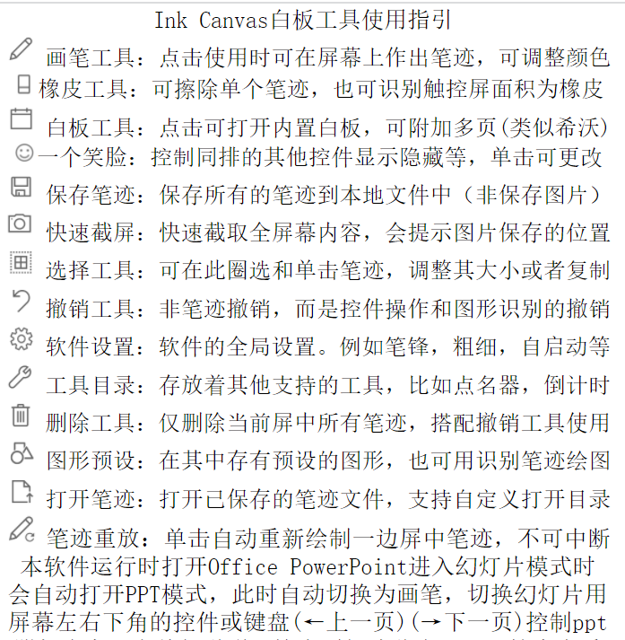

# Ink Canvas 使用说明

## 目录
[一、介绍](#intro)  
[二、用法](#usage)  
[三、技巧](#skill)  
[四、感谢](#thank)  
[五、图片](#pictu)
## Ink Canvas 是什么? 
Ink Canvas 画板是一款轻量级画板软件，其针对希沃白板设备进行了特别优化，与预装的“希沃白板 5”软件相比，启动速度大幅度提升（提升5-10 倍），系统资源占用更小，使用体验更佳。  

可以双指缩放拖动甚至旋转，并针对Microsoft PowerPoint 进行优化，可以在放映幻灯片的时候打开白板或黑板进行板书，提高课堂效率。拥有智能墨迹识别技术，可识别圆形等图形，并自动转换。  

统一幻灯片放映时和白板/黑板模式下的墨迹书写体验，形成统一操作习惯。

### Ink Canvas 模式

* **幻灯片模式**
    *  在幻灯片模式下支持画笔、橡皮擦、图形工具、快捷翻页按键、换页自动换笔迹等功能
    *  自动保存幻灯片下的墨迹，下次打开时墨迹将自动恢复，并且随时可修改。
    *  如果有隐藏的幻灯片页面，将询问是否取消隐藏
* **画板模式（黑/白板模式）**
    *  在画板模式下有着一整个类似希沃白板一样的画板
    *  支持添加新页面和页面切换
    *  支持多指书写：黑板模式界面左下角人像图标为切换按钮
	*  默认是黑板，可以在设置中调成白板
* **屏幕画笔模式**
    *  在屏幕画笔模式下可以显示原屏幕内容的同时将鼠标调为画笔书写授课笔迹

### Ink Canvas 特性
* 笔细的一头可以在屏幕上留下墨迹，而粗的一头可以当作橡皮擦（按笔画擦除），不必手动切换模式
* 如果觉得翻转笔比较麻烦，可以直接用手指或倾斜笔尖精确擦除小范围墨迹
* 手掌手指并拢，直接放在屏幕上，则是大橡皮（按区域擦除），此动作的识别速度和精度比“希沃白板 5”要高，即碰即擦，无需等待
* 启动速度快
* 更换画笔颜色更方便，不必先点击笔，再切换，清屏也更方便
* 自动查杀希沃部分软件
* 单条或多条墨迹选中后缩放、旋转、移动、克隆
* 全屏幕笔迹双指手势缩放（旋转和拖动也是双指手势）
* 图形绘制（支持长按一直选中）
  直线、虚线、带箭头直线
  多条平行线，带焦点和不带焦点的椭圆、双曲线、抛物线。
  正圆、虚线圆，圆柱、圆锥、长方体
  坐标系（平面直角坐标系，空间直角坐标系）
* 墨迹转图形，目前可实现智能识别圆、三角形、特殊四边形
  自动转换为规范图形。可自动识别同心圆，相切圆，可自动识别球的截面圆

### Ink Canvas 功能  
* **倒计时**：美观的 UI，并可以以接近全屏的大小显示
* **抽奖**：可导入名单（建议搭配 Excel 使用），可设置抽取人数
* **保存墨迹**：默认保存至 `文档\Ink Canvas Strokes`
* **截图**：任意模式模式下（包括鼠标）下点击相机图标截图并自动保存至 `图片\Ink Canvas Screenshots`，可在设置中开启“截图时自动保存墨迹”
* **幻灯片自动保存墨迹**：默认保存至 `文档\Ink Canvas Strokes`
* **墨迹回放**：从头自动书写一遍屏中墨迹

## 用法 
### 画笔设置
* **颜色**：在“画笔模式”下直接点击主界面的颜色球即可
* **粗细**：点击“设置”齿轮，在“画板”——“画笔粗细”中调整，默认5
* **笔锋**：在“设置”齿轮中，有根据“速度”和“尾迹”绘制笔锋，让笔迹更美观
### 橡皮擦使用
* **笔迹擦除**：单击一次使图标变为灰色可按笔迹擦除内容
* **范围擦除**：单击多一次使图标变蓝色可按提示图案范围擦除
* **手掌擦除**：在画笔模式下按压手掌即可起到橡皮擦擦除功能（部分屏幕不支持）
### 绘制预设图形
* **正圆**：确定圆心时可选用预设在“原点”位置点击，再拖动鼠标完成正圆绘制
* **抛物线**：可以在“原点”位置点击，再拖动鼠标
* **双曲线**：在“原点”位置点击拖动鼠标，先确定渐近线，然后确定实轴和虚轴
* **椭圆**：在“原点”位置点击拖动鼠标，然后确定长轴和短轴（椭圆和双曲线都可以选择有无显示焦点的预设）
* **长方体**：先确定正视图，然后再次点击，确定侧视宽
* **圆锥、圆柱**：一气呵成
* **平面直角坐标系**：有多种预设，图标中两线交点上下左右的长边为实际绘制边。
* **空间直角坐标系**：三轴同时绘制
* **平行线**：从一端到另一端，适合绘制匀强电场的电场线，并针对特殊角度优化
### ppt放映模式
* **翻页**：屏幕中无笔迹时可以多指并排上下滑动翻页，以及控件和键盘方向键翻页
* **保存**：ppt中的笔迹自动保存，还可以移动笔迹文件夹到其他电脑正常使用原笔迹
ppt模式下打开的内置画板和正常打开的画板一样的，可能需要用户自行关注保存问题
### 自动墨迹识别（Ink To Shape)
1. 尽可能画得标准和规范一些
2. 正圆内画椭圆，可完成截面圆、同心椭圆（适用于天体轨迹）的识别
3. 可自动完成同心圆、相切圆的识别（内切、外切）

### 预览界面

## 技巧 
1. 双击“清屏”按钮即可在清屏的同时隐藏画板，相当于点击“清屏”和“隐藏画板”两个按钮。
2. 一不小心擦错了，点击“撤销”按钮即可撤销，再次点击即可恢复。
3. 如果需要关闭Ink Canvas画板，可在设置中找到关闭按钮。
4. 在任意时刻，点击“黑板”按钮即可进入黑板。
5. 空间不够写时，可以双指向上滑动来挪动原有墨迹，也可以双指缩放以腾出空间。
6. 找不到“橡皮”按钮？笔反过来就是橡皮了！如果觉得翻转笔比较麻烦，可以直接用手指或倾斜笔尖精确擦除小范围墨迹。大范围擦除可以通过并拢手指使用手掌或手背，甚至黑板擦、抹布来完成。建议使用手背而非手掌，因为手掌上汗较多，在屏幕上滑动时摩擦较大，且较大的接触面积可能导致误识别为多指（多指缩放）的问题。

## 感谢 
特别感谢 [yuwenhui2020](https://github.com/yuwenhui2020) 为 ` Ink Canvas 使用说明` 做出的贡献！

## 图片版说明

此为带图标的简易说明  
  
图片预览https://yuwenhui2020.github.io/ink/BHH~7AJ6N7OMLT095LO(LQJ.png

